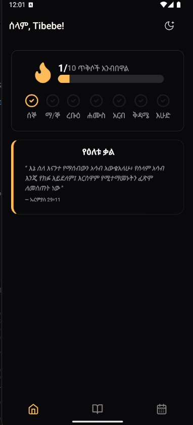
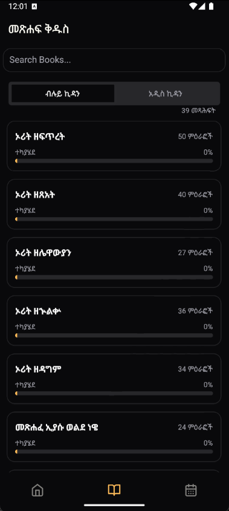
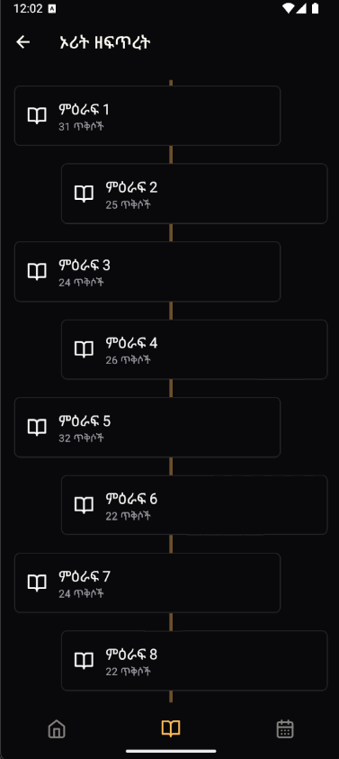
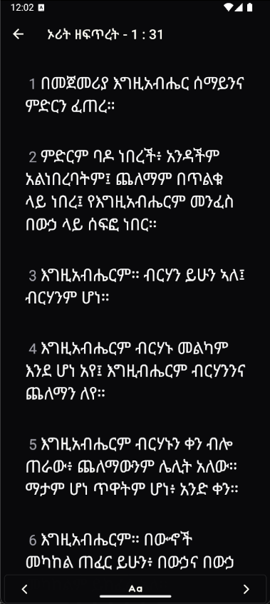
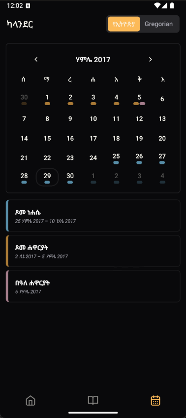
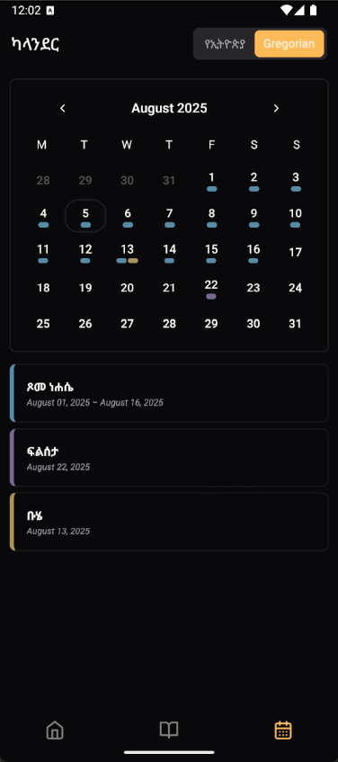

# Tinat - Ethiopian Orthodox Bible Reading App

**Tinat** is a modern Bible reading application specifically designed for the Ethiopian Orthodox community. The app combines traditional scripture reading with modern gamification features to encourage daily Bible engagement through streak tracking and goal setting.

## Features

### 📖 Bible Reading
- Daily verse display
- Ethiopian Orthodox Bible in Amharic and English
- Easy navigation through books and chapters
- Motivational streak counter to encourage consistent reading
- Clean, readable interface optimized for extended reading sessions


<div align="center">
  
  
  
  
</div>

### 📅 Religious Calendar
- Comprehensive Ethiopian Orthodox calendar with religious events
- Dual calendar support: Ethiopian and Gregorian calendars
- Important religious holidays and fasting periods
- Seamless switching between calendar systems

<div align="center">
  
  
</div>

## Technology Stack

- **Framework**: React Native with Expo
- **Components**: react-native-reusables for consistent UI
- **Navigation**: Expo Router
- **Database**: Expo SQLite with Drizzle ORM
- **Data Fetching**: TanStack Query
- **State Management**: Zustand
- **Internationalization**: i18next

## Getting Started

### Prerequisites
- Node.js (v16 or higher)
- npm or yarn
- Expo CLI
- For iOS development: [Xcode](https://developer.apple.com/xcode/)
- For Android development: [Android Studio](https://developer.android.com/studio)
### Installation

1. **Clone the repository**
   ```bash
   git clone https://github.com/tib-source/Tinat.git
   cd Tinat
   ```

2. **Install dependencies**
   ```bash
   npm install
   ```

3. **Start the development server**
   ```bash
   npm run dev
   ```

4. **Linting**
   ```bash
   npm run lint
   ```

## Project Structure

```
app/                 # Expo Router pages and navigation
├── (tabs)/          # Tab-based navigation
│   ├── index.tsx    # Home screen
│   ├── bible/       # Bible reading screens
│   └── calendar/    # Calendar screens
components/          # Reusable UI components
src/
├── db/              # Database schema and seeding
├── helpers/         # Utility functions
├── hooks/           # Custom React hooks
├── providers/       # React context providers
├── queries/         # TanStack Query definitions
└── state/           # Zustand store
```

For questions, suggestions, or support, please open an issue on GitHub.

---

**Tinat** - Strengthening faith through daily scripture reading 📖✨
